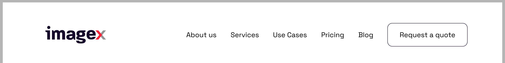
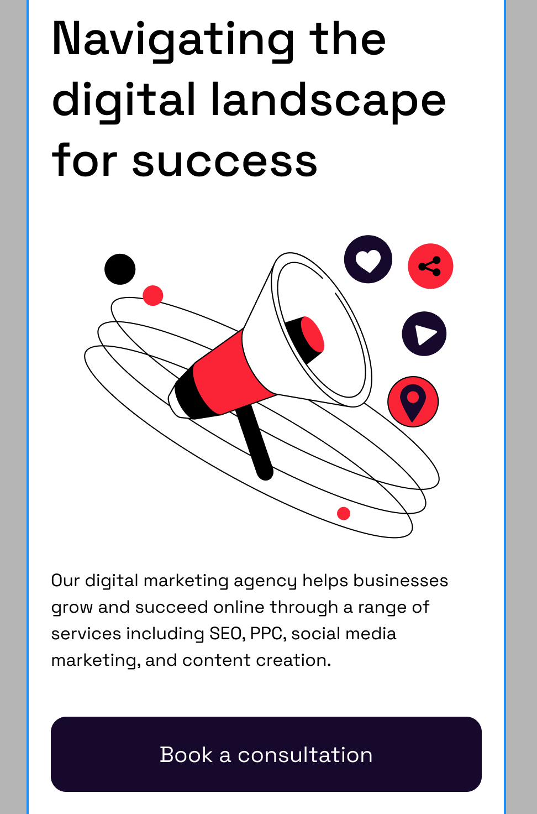
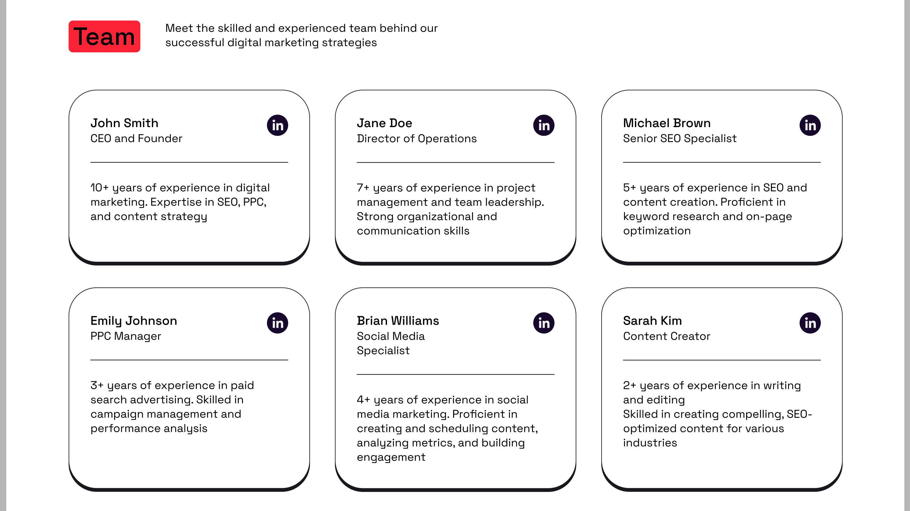
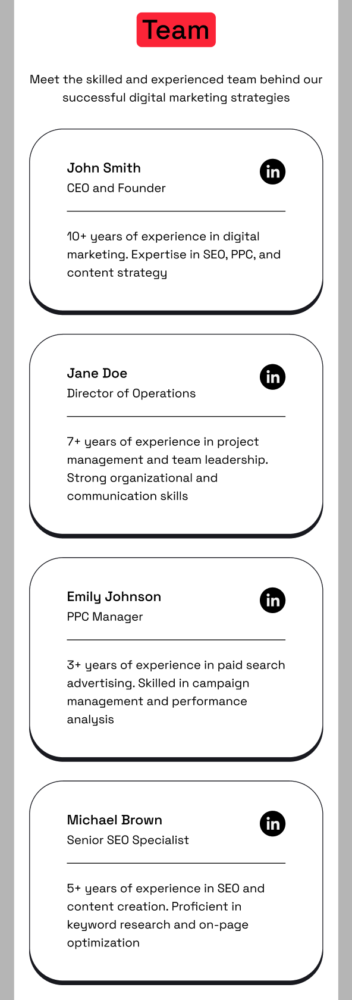
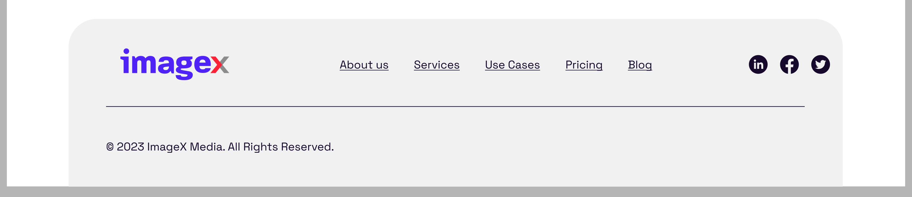
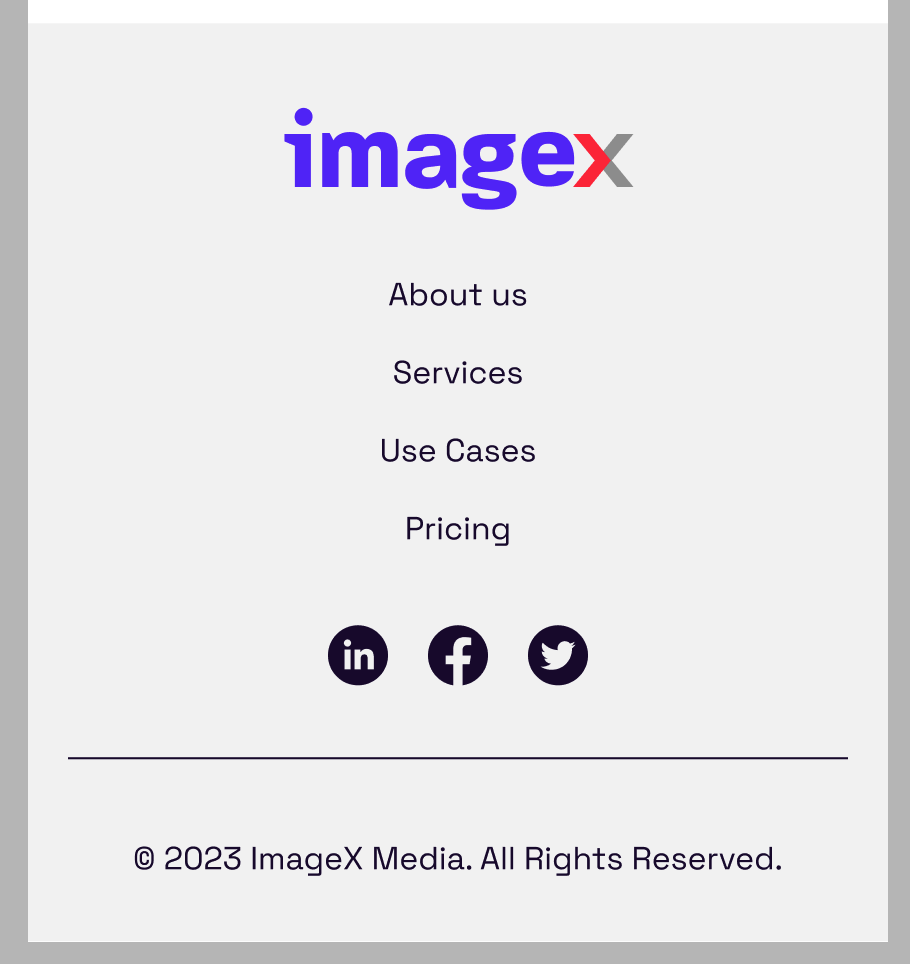

# IXM Developer Skill Assessment

## Objective:
This assessment aims to evaluate your expertise in both frontend and backend Drupal development, as well as your general web development skills.
You'll be tasked with developing a landing page that incorporates several key features often encountered in our projects.

## The Project Design
The design for the landing page is provided on Figma. You can find it by using this link [Imagex Skill Assesment Design](https://www.figma.com/design/uGmBtSv3LaG7QZnbRWBP5S/IXM-Developer-Skill-Assessment).

## Requirements:

* The project must be built using [Bootstrap](https://getbootstrap.com/).
* We expect a fully responsive theme.
* Feel free to use any Drupal modules or make any architectural decisions you deem necessary.
* Implement small, frequent commits with clear and descriptive commit messages. Each commit should address a single feature.
* You should not spend more than 16 hours on this assignment. Please indicate the total time spent on each of the features in your README.md.
* Provide a copy of the database including the content used for the landing page. Add it in the `database` folder with the name `skill-assesment.sql`

## Landing Page Features:

### Header:



* The company logo.
* A customizable menu.
* A CTA (Call to Action) button.

### Hero Banner:

#### Desktop


#### Mobile


* A custom block that can be placed on any page.
* Users should be able to add a title, description, image, and CTA button.

### Team Section:

#### Desktop


#### Mobile


* A block displaying team members.
* Data should be fetched from an external [API](https://dummyjson.com/docs).
* API integration must include authentication, and the block should allow configuration to select the number of team members displayed.

### Footer:

#### Desktop


#### Mobile


* The company logo.
* A customizable menu.
* A list of social media links.
* Copyright information.

### Additional Notes:
* Focus on clean, maintainable code.
* Ensure the website is responsive and optimized for both desktop and mobile.


---

## Getting Started
The project includes the foundational setup commonly used in IXM projects.

Here are the steps to get started with the project:

### Docker (Docksal)
You need the *latest version* of Docksal to run the environment. If you don't have Docksal installed, you can find installation instructions [here](https://docksal.io/installation).

If you're not sure if you have the latest version of Docksal, you can run
```shell
fin update
```

After Docksal is installed you can continue to Project Setup:

### Frontend
The project uses SDC and in case you have any additional questions please consult the `FRONTEND.MD`


### Project Setup

1-) Edit your `/etc/hosts` file to include the following:

`127.0.0.1 ixm-developer-skill-assessment.docksal.site`

2-) Install the [Docksal Addon for local HTTPS](https://docs.docksal.io/tools/mkcert/#setup-and-usage-via-addon)

3-) Create the local certificates for `*.ixm-developer-skill-assessment.docksal.site` and `ixm-developer-skill-assessment.docksal.site`
```shell
fin mkcert create
```

4-) Restart the project to apply the new certificates.
```shell
fin project restart
```

5-) Copy Local Settings and Services to the project:
```shell
cp .docksal/local.settings.php docroot/sites/default/settings/local.settings.php
cp .docksal/development.services.yml docroot/sites/development.services.yml
```

5-) Install the project dependencies using composer within the container.

```shell
fin composer install
```

6-) Import the provided database dump.
```shell
fin db import ./database/db.sql --progress
```

7-) Install frontend packages and build frontend assets using yarn
```shell
fin swat frontend:install
fin swat frontend:build
```

Once it's finished, you should be able to open [https://ixm-developer-skill-assessment.docksal.site/]()

Good luck!
